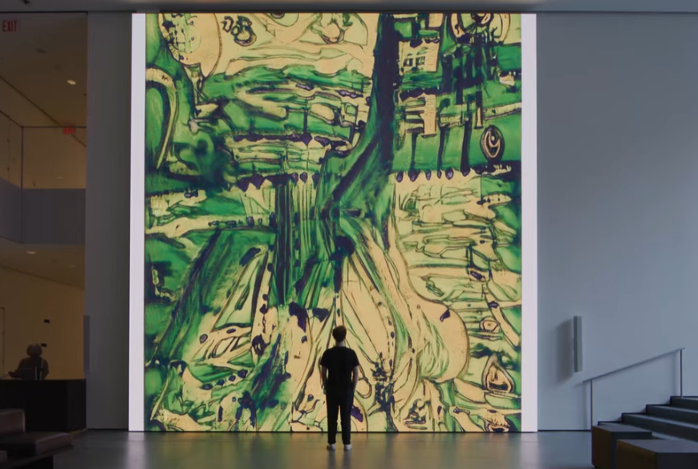
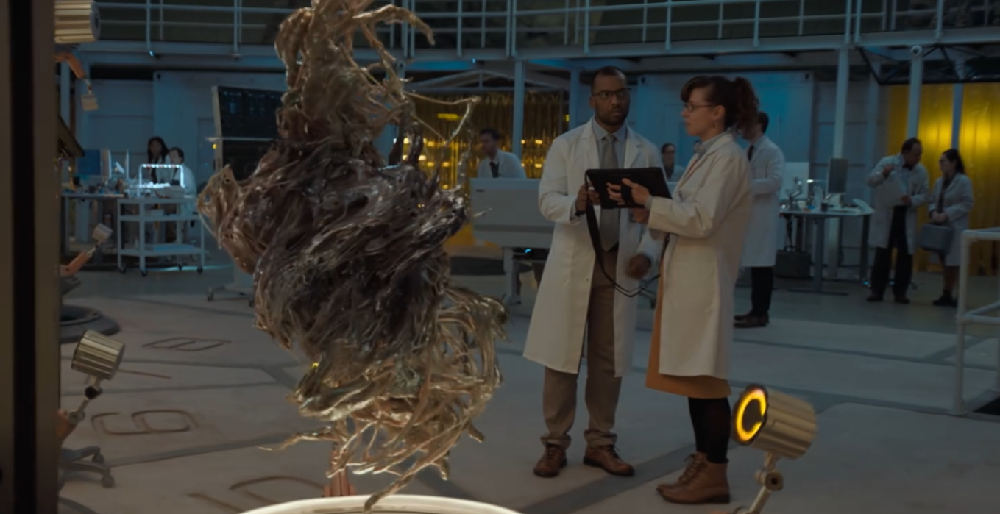
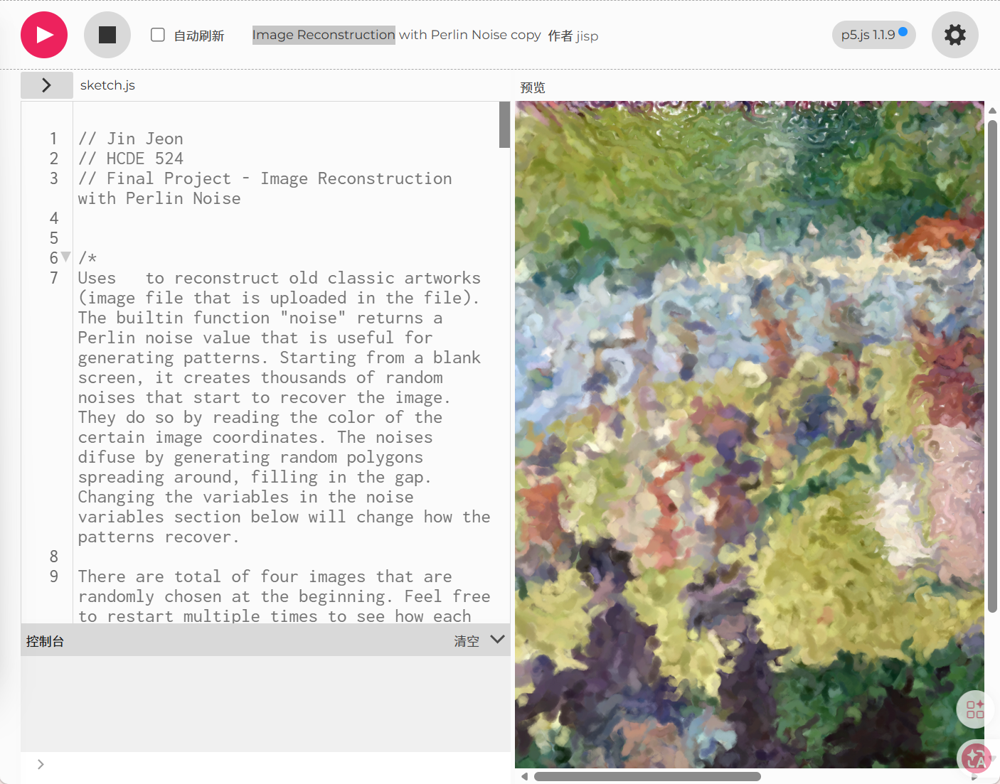

# ywan0820_9103_tut05
# Quiz 8 – Design Research

## Part 1: Imaging Technique Inspiration
### I want to use a dynamic visual effect like the one shown: it resembles a water surface saturated with pigment, constantly morphing, somewhat akin to the fluid, particle-like motion of Venom in the film—color patches flow and shift positions. For the assignment, I'd use this to abstractly deconstruct paintings, making them appear to melt onto water, pigments flowing yet still recognizable.
### EXAMPLE

## Part 2: Coding Technique Exploration
### The code uses Perlin noise to scatter thousands of small polygons and circles that constantly drift and mutate. Each particle samples a color from a loaded painting, then moves according to noise-driven vectors. By refreshing particles' targets and letting them redraw the image through drifting colored shapes, it creates a melting, fluid reconstruction. This technique perfectly supports my idea of abstractly deconstructing a painting so it appears as flowing pigment on water, while still being recognisable.
### EXAMPLE

[Image Reconstruction](https://editor.p5js.org/jisp/sketches/X_3R9c3Zy)
